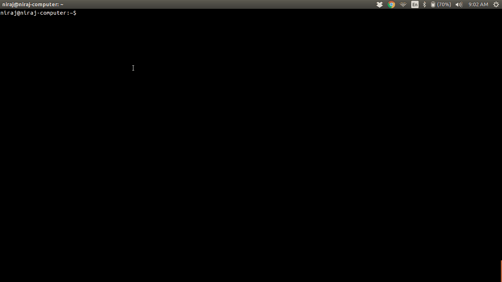

# git-tip [](https://travis-ci.org/nirajpandkar/git-tip)

> CLI that gives a random git-tip.

The git-tips [JSON file](https://github.com/git-tips/tips/blob/master/tips.json) is taken from this awesome project - [git-tips](https://github.com/git-tips/tips)



## Install

```
$ npm install --global git-tip
```

### Script to greet yourself with a git-tip every time a new terminal opens

```
which git-tip >> ~/.bashrc
```

## Usage

```
  Usage
      $ git-tip [options]
  Options
      --help    Provides usage help (Shows the current page)
      --all     Gives all the git tips
      <keyword> Gives the git tips consisting of the keyword
  Examples
      $ git-tip bypass

      1. Bypass pre-commit and commit-msg githooks
      => git commit --no-verify

      $ git-tip

      Git Tip of the Terminal
      -------------------------
      Saving current state of tracked files without commiting
      => git stash
```

## Todo

- [x] Basic Functionality
- [x] Help page
- [x] Add continuous integration(Travis CI)
- [x] Add tests
- [ ] Add more relevant tests to increase code coverage
- [x] Code coverage
- [ ] Add code coverage reports
- [x] Script to automatically update tips.json file when installing globally from npm
- [x] Script to execute `git-tip` every time a new terminal opens

## License
MIT © [Niraj Pandkar](https://github.com/nirajpandkar)
